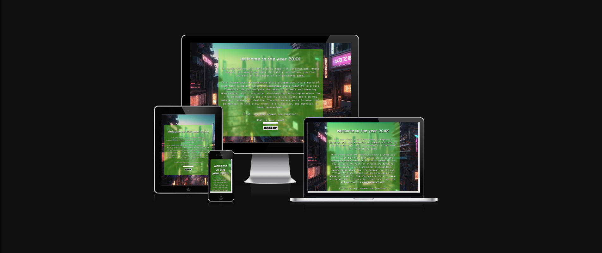
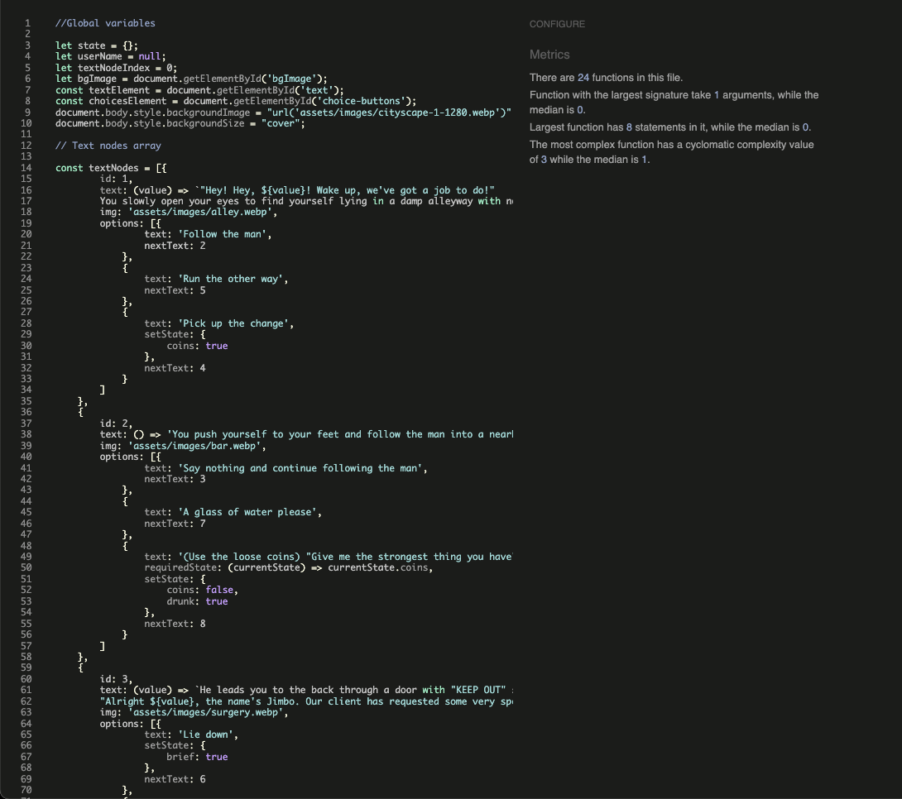
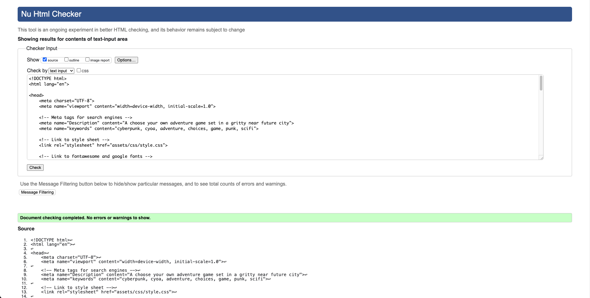
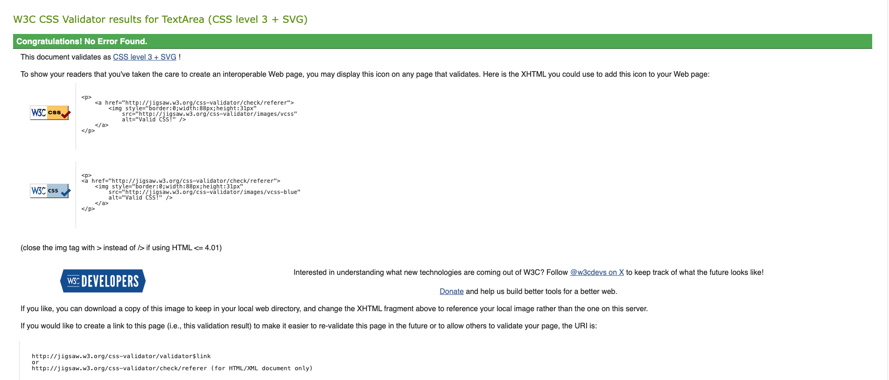

# Diamonds in the Rust
A choose-your-own-adventure style game set in a cyberpunk future.

Find the live site [here]

[here]: https://isthatafife.github.io/DiamondsInTheRust/

## Contents

* [User Experience](#user-experience-ux)
  * [User Stories](#user-stories)

* [Design](#design)
  * [Typography](#typography)
  * [Imagery](#imagery)
  * [Wireframes](#wireframes)

* [Features](#features)
  * [General Features on Each Page](#general-features-on-each-page)
  * [Future Implementations](#future-implementations)
  * [Accessibility](#accessibility)

* [Technologies Used](#technologies-used)
  * [Languages Used](#languages-used)
  * [Frameworks, Libraries & Programs Used](#frameworks-libraries--programs-used)

* [Deployment & Local Development](#deployment--local-development)
  * [Deployment](#deployment)
  * [Local Development](#local-development)
    * [How to Fork](#how-to-fork)
    * [How to Clone](#how-to-clone)

* [Testing](#testing)

* [Credits](#credits)
  * [Code Used](#code-used)
  * [Content](#content)
  * [Media](#media)
  * [Acknowledgements](#acknowledgements)

  ---

  ## User Experience (UX)

  ### Initial Discussion

  This website aims to craft a user-led story by providing detailed descriptions of each scene and offering the player choices that can either drive the story forward, change future outcomes by collecting items or end in a game over screen.

  #### Key Areas Covered

    - A website design that reflects the near-future setting of the game.
    - Background images which give the user an idea of the scene they are currently in.
    - A number of choices for the player to make in order to drive the story forward.
        - These will be presented as clickable buttons using Javascript to change to the appropriate scene after clicking.
    - An ending screen (either good or bad) which reflects the player's path through the story and includes a button to restart from the beginning.

## User Stories

### Client Goals

- To be able to view the site on a range of device sizes.
- To make it easy for users to understand what the site is about.
- To make the design and layout visually appealing to maintain interest.
- To allow users to craft their own story utilising choices they make.

### First Time Visitor Goals

- I want to quickly and clearly find out what the site is about.
- I want to be able to navigate the site easily.
- I want to be able to make meaningful choices to propel the story forward.
- I want to be able to start again from the beginning in order to make different choices.

### Returning Visitor Goals

- I want to have a new experience by making different choices.

---

## Design

The website uses many typical "cyberpunk" design choices - The background images contrast a grungy, dirty cityscape with bright neon pink and blue hues while the main game area is made to look like an old-school computer terminal with a dot matrix font.

### Typography

Google Fonts was used for the following fonts:

  - Dot-gothic is used for most text on the site. It is a sans-serif font.
  - Tektur is used for the choice button text. It is a sans-serif font.
  - Rubik Glitch is used for certain interactions. It is a sans-serif font.

### Imagery

Imagery will be AI generated using fooocus and will reflect the gritty, near-future world that the player finds themself in.

### Wireframes

Wireframes were created for mobile and desktop.

[Mobile]

[Desktop]

[Mobile]: docs/wireframes/ditrmobile.png
[Desktop]: docs/wireframes/ditrdesktop.png

## Features

The website will be a single page and all navigation will be done through 2-4 "choice" buttons presented to the player. Once a choice is made (button clicked), the scene will change, including the background image, text box and choice buttons.

The player will be able to make choices early on that will affect what other choices will be available to them later on. For example, they can choose to take or leave an item in scene 2 which will determine whether or not they will have another choice to make later on.

Once players reach the end by either completing the story or reaching a GAME OVER screen, they will be presented with a button to restart from the beginning.

Choices can be made by clicking the buttons.

### Future Implementations

  - Add a soundtrack and sound effects to further immerse the player. The soundtrack will start off disabled and players can unmute when/if they want.
  - Add keyboard functionality, so the user can instead use keyboard keys 1-4 instead of clicking the buttons.

## Accessibility

I have been mindful during coding to ensure that the website is as accessible friendly as possible. I have achieved this by:

  - Using semantic HTML.
  - Using descriptive alt attributes on images on the site.
  - Ensuring that there is a sufficient colour contrast throughout the site.

  ---

  ## Technologies Used

  ### Languages Used

  HTML5, CSS and JavaScript were used to create this website.

  ### Frameworks, Libraries & Programs Used

  Balsamiq - Used to create wireframes.

  Git - For version control.

  Github - To save and store the files for the website.

  Google Fonts - To import the fonts used on the website.

  Font Awesome - For the iconography on the website.

  Google Dev Tools - To troubleshoot and test features, solve issues with responsiveness and styling.

  fooocus - To generate background images using AI.

  [Tiny PNG](https://tinypng.com/) To compress images.

  [Pixlied](https://pixelied.com) To convert images to webp format.

  [Favicon.io](https://favicon.io/) To create favicon.

  [Am I Responsive?](http://ami.responsivedesign.is/) To show the website image on a range of devices.

  ---

## Deployment & Local Development

### Deployment

Github Pages was used to deploy the live website. The instructions to achieve this are below:

1. Log in (or sign up) to Github.
2. Find the repository for this project, DiamondsInTheRust.
3. Click on the Settings link.
4. Click on the Pages link in the left hand side navigation bar.
5. In the Source section, choose main from the drop down select branch menu. Select Root from the drop down select folder menu.
6. Click Save. Your live Github Pages site is now deployed at the URL shown.

### Local Development

#### How to Fork

To fork the DiamondsInTheRust repository:

1. Log in (or sign up) to Github.
2. Go to the repository for this project, isthatafife/DiamondsInTheRust.
3. Click the Fork button in the top right corner.

#### How to Clone

To clone the DiamondsInTheRust repository:

1. Log in (or sign up) to GitHub.
2. Go to the repository for this project, isthatafife/DiamondsInTheRust.
3. Click on the code button, select whether you would like to clone with HTTPS, SSH or GitHub CLI and copy the link shown.
4. Open the terminal in your code editor and change the current working directory to the location you want to use for the cloned directory.
5. Type 'git clone' into the terminal and then paste the link you copied in step 3. Press enter.

---

## Testing

Testing was ongoing throughout the entire build of the website. I used Chrome developer tools, JSHint and Perplexity AI during development to troubleshoot issues.

### JSHint

### W3C Validator

### Jigsaw CSS Validator

### Solved Bugs

1. Initially the game would return "undefined" or nothing at all instead of the user's input on the welcome screen. This was because the game was being started before the userName variable was updated. With the help of tutor support I was able to rearrange the code and order of execution, creating a new getUserName() function and placing it inside the initGame() function, ensuring it would return the updated variable when the game started.
2. If there was no img property in a text node, or if there was no text node ID, the background was not displayed. This was fixed by adding an if/else statement to the showTextNode function that would display a default image if there was no img property present.

### Known Bugs

1. Sometimes when loading a new scene, the default image will be displayed first before loading in the correct scene image.

### Lighthouse

I used Lighthouse within the Chrome Developer Tools to allow me to test the performance, accessibility, best practices and SEO of the website.

#### Main Page

[Lighthouse Testing for Desktop - Test 1](docs/testing/lighthouse/ditr-lighthouse-desktop.pdf)

[Lighthouse Testing for Mobile - Test 1](docs/testing/lighthouse/ditr-lighthouse-mobile.pdf)

### Full Testing

To fully test my website I performed the following testing using a number of browsers (Chrome, Safari, Mozilla Firefox, Duckduckgo) and devices (Mac Studio M1 Ultra, Macbook Pro 16", OnePlus 10 Android phone, iPhone 13 pro).

I also viewed both pages in Chrome developer tools to ensure they were responsive on all screen sizes.

---

## Credits

### Code Used

Some of the code required to get the user's name and return it within the game was either provided or inspired by John & Sean of CI Tutor support.

Game structure was inspired by youtube tutorials by [Web Dev Simplified](https://www.youtube.com/@WebDevSimplified), [Kevin Briggs](https://www.youtube.com/@kevinbriggs8354) and [Galvanize/Lee Ngo](https://github.com/GalvanizeOpenSource/Learn-To-Code-JavaScript-2/)

Main text area styling from [CSS Glass](https://css.glass/)

### Media

All background images created using [fooocus](https://github.com/lllyasviel/Fooocus) AI generator

### Acknowledgements

I would like to thank the following people who helped me along the way in completing my second milestone project:

[Lauren-Nicole Popich](https://github.com/CluelessBiker) - My Code Institute mentor

John & Sean of CI tutor support

Everyone in the Nov2023-lwetb cohort!